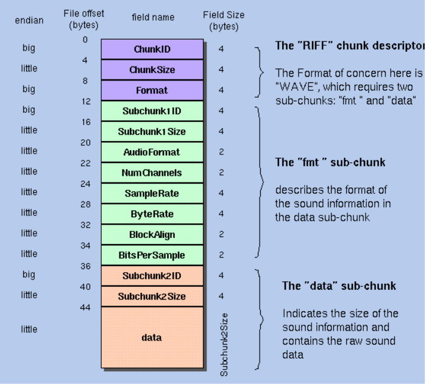

## The **"WAVE"** format consists of a header and two subchunks:

### The canonical WAVE format starts with the **"RIFF header"**: 
0 &nbsp; 4 &nbsp; **ChunkID** &nbsp; Contains the letters "RIFF" in ASCII for (0x52494646 big-endian form). 
4 &nbsp; 4 &nbsp; **ChunkSize** &nbsp; 36 + SubChunk2Size, or more precisely: 
&nbsp; &nbsp; &nbsp; &nbsp; &nbsp; 4 + (8 + SubChunk1Size) + (8 + SubChunk2Size) 
&nbsp; &nbsp; &nbsp; &nbsp; &nbsp; entire file in bytes minus 8 bytes for the 
&nbsp; &nbsp; &nbsp; &nbsp; &nbsp; two fields not included in this count: 
&nbsp; &nbsp; &nbsp; &nbsp; &nbsp; ChunkID and ChunkSize. 
8 &nbsp; 4 &nbsp; **Format** &nbsp; Contains the letters "WAVE" 
&nbsp; &nbsp; &nbsp; &nbsp; &nbsp; (0x57415645 big-endian form).  

### The **"fmt "** subchunk describes the sound data's format:  
12 &nbsp; 4 &nbsp; **Subchunk1ID** &nbsp; Contains the letters "fmt " 
&nbsp; &nbsp; &nbsp; &nbsp; &nbsp; (0x666d7420 big-endian form).  
16 &nbsp; 4 &nbsp; **Subchunk1Size** &nbsp; 16 for PCM.  This is the size of the 
&nbsp; &nbsp; &nbsp; &nbsp; &nbsp; rest of the Subchunk which follows this number. 
20 &nbsp; 2 &nbsp; **AudioFormat** &nbsp; PCM = 1 (i.e. Linear quantization) 
&nbsp; &nbsp; &nbsp; &nbsp; &nbsp; Values other than 1 indicate some 
&nbsp; &nbsp; &nbsp; &nbsp; &nbsp; form of compression. 
22 &nbsp; 2 &nbsp; **NumChannels** &nbsp; Mono = 1, Stereo = 2, etc. 
24 &nbsp; 4 &nbsp; **SampleRate** &nbsp; 8000, 44100, etc. 
28 &nbsp; 4 &nbsp; **ByteRate** &nbsp; == SampleRate * NumChannels * BitsPerSample/8 
32 &nbsp; 2 &nbsp; **BlockAlign** &nbsp; == NumChannels * BitsPerSample/8 
&nbsp; &nbsp; &nbsp; &nbsp; &nbsp; The number of bytes for one sample including 
&nbsp; &nbsp; &nbsp; &nbsp; &nbsp; all channels. I wonder what happens when 
&nbsp; &nbsp; &nbsp; &nbsp; &nbsp; this number isn't an integer? 
34 &nbsp; 2 &nbsp; **BitsPerSample** &nbsp; 8 bits = 8, 16 bits = 16, etc.  
  
### The **"data"** subchunk contains the size of the data and the actual sound: 
36 &nbsp; 4 &nbsp; **Subchunk2ID** &nbsp; Contains the letters "data" 
&nbsp; &nbsp; &nbsp; &nbsp; &nbsp; (0x64617461 big-endian form). 
40 &nbsp; 4 &nbsp; **Subchunk2Size** &nbsp; == NumSamples * NumChannels * BitsPerSample/8 
&nbsp; &nbsp; &nbsp; &nbsp; &nbsp; This is the number of bytes in the data. 
&nbsp; &nbsp; &nbsp; &nbsp; &nbsp; You can also think of this as the size 
&nbsp; &nbsp; &nbsp; &nbsp; &nbsp; of the read of the subchunk following this 
&nbsp; &nbsp; &nbsp; &nbsp; &nbsp; number. 
44 &nbsp; * &nbsp; **Data** &nbsp; The actual sound data. 
